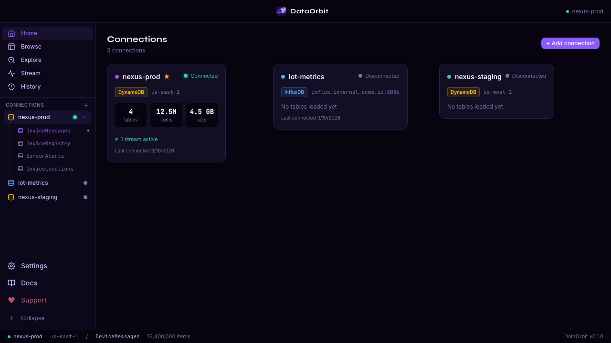
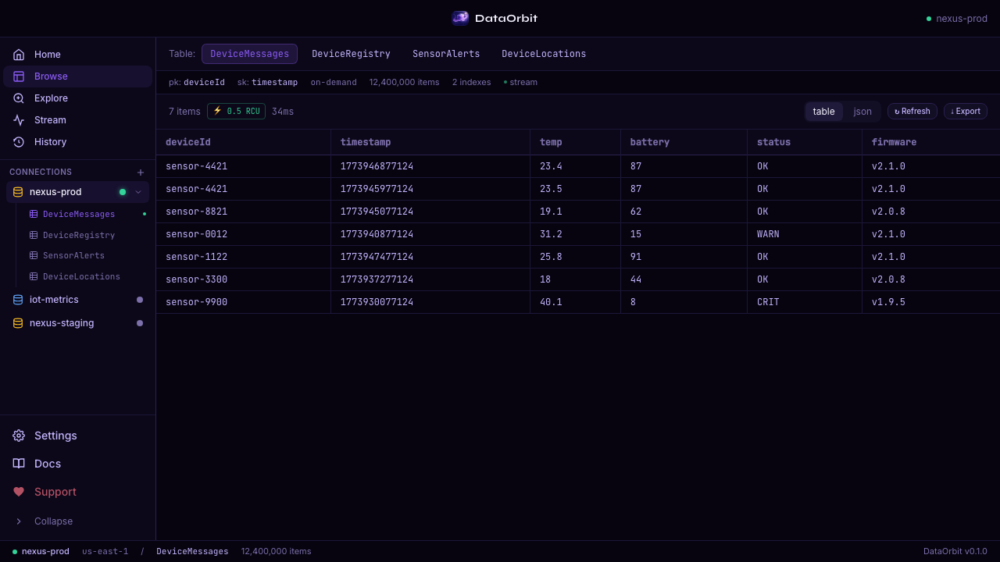
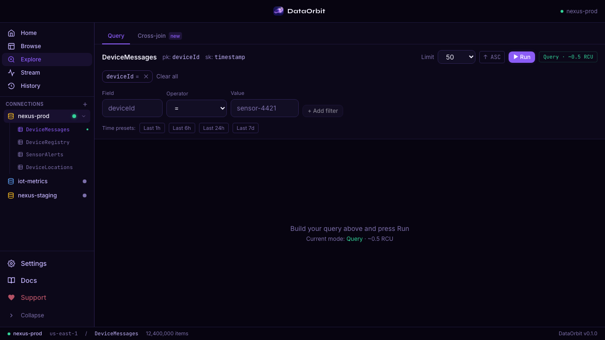
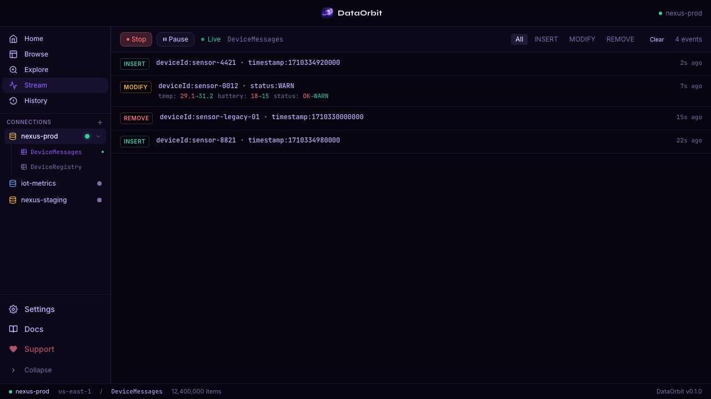
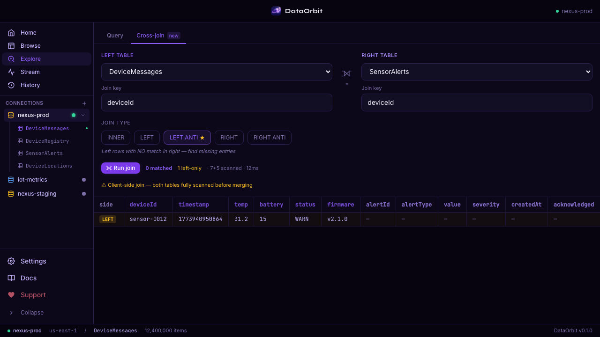
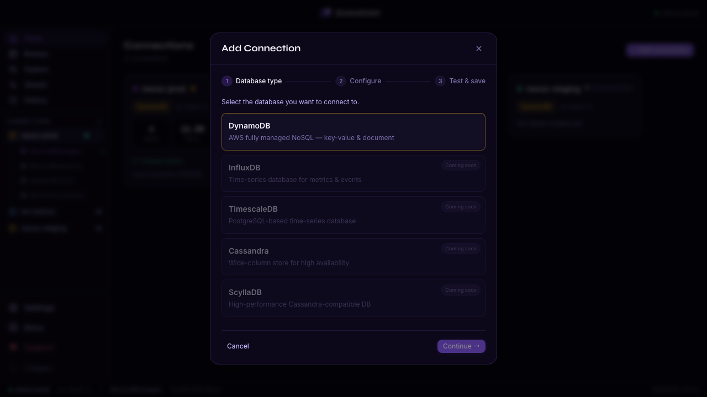

# DataOrbit

**Database management client built for DynamoDB-first workflows.** Visual filter builder, live Streams tail, cross-table joins, and Time Trace — everything the AWS console refuses to give you.

Part of the [SlothLabs](https://slothlabs.org) family — native Rust, free forever.

---

## Screenshots

| Home — connection list | Browse — grid view | Explore — filter builder |
|---|---|---|
|  |  |  |

| Live stream tail | Cross-join (Left Anti) | Add connection wizard |
|---|---|---|
|  |  |  |

---

## Features (v0.2.0)

| Feature | Status |
|---|---|
| DynamoDB — browse tables & items | ✅ |
| DynamoDB — visual filter/query builder (12 operators) | ✅ |
| DynamoDB — client-side filtering (exact results, no scan waste) | ✅ |
| Scan confirmation — large table protection | ✅ |
| Field autocomplete from table schema | ✅ |
| Hierarchical / composite key support (`begins_with` on `country::zone::id` patterns) | ✅ |
| DynamoDB — live Streams tail | ✅ |
| Cross-table joins (INNER / LEFT / LEFT ANTI ★ / RIGHT / RIGHT ANTI) | ✅ |
| **Time Trace — cross-table event timeline** ★ | ✅ |
| Index recommendations — GSI suggestions after inefficient scans | ✅ |
| Pagination with remaining count | ✅ |
| Sort direction toggle (ASC / DESC) | ✅ |
| Time-range presets (Last 1h / 6h / 24h / 7d) | ✅ |
| Pre-run cost estimator (Query/Scan mode + estimated RCU) | ✅ |
| Query history | ✅ |
| Multiple connections | ✅ |
| AWS profile / access keys / ENV auth | ✅ |
| DynamoDB Local support | ✅ |
| InfluxDB, TimescaleDB, Cassandra, ScyllaDB | 🚧 Coming soon |

---

## ★ Time Trace — cross-table event timeline

> **The problem every DynamoDB team hits:** when a battery-critical alert fires on a sensor,
> it's supposed to write to four tables — `DeviceMessages`, `SensorAlerts`, `DeviceRegistry`,
> and `NotificationHistory`. Did all four writes succeed?
> With standard DynamoDB tools you open each table separately, copy-paste the entity ID, and pray.

**Time Trace automates this.** Give it a field and value — `deviceId = sensor-0012` — and it searches every table in your connection simultaneously, resolves timestamps, and renders a chronological timeline. Tables where the entity was **expected but not found** are called out in a warning panel — pointing directly to the dropped write.

### What no other tool does today

| Tool | Single table | Cross-table search | Chronological timeline | Missing-table detection |
|------|:-----------:|:------------------:|:---------------------:|:----------------------:|
| AWS Console | ✅ | ❌ | ❌ | ❌ |
| NoSQL Workbench | ✅ | ❌ | ❌ | ❌ |
| **DataOrbit Time Trace** | ✅ | **✅** | **✅** | **✅** |

---

## Installation

### Download

Grab the latest `.dmg` / `.exe` / `.AppImage` from the [Releases](https://github.com/slothlabsorg/dataorbit/releases) page.

### macOS (Homebrew) — coming soon

```bash
brew install slothlabs/tap/dataorbit
```

---

## CloudOrbit + BastionOrbit integration

- **CloudOrbit**: reference the same `~/.aws` profile in DataOrbit — it picks up temporary credentials automatically.
- **BastionOrbit**: open a tunnel to your database port, then add a DataOrbit connection pointing to `localhost:<localPort>`. No VPN needed.

---

## Development

Requirements: Node 18+, Rust stable, Tauri v2 CLI.

```bash
npm install
npm run tauri dev
```

Browser dev mode (mock data, no Tauri binary):

```bash
npm run dev
# Open http://localhost:1421/?mock=1
```

---

## Testing

```bash
# Unit tests (Vitest)
npm test

# Playwright screenshot suite
npm run screenshots
```

Rust unit tests:

```bash
cd src-tauri
cargo test
```

---

## Contributing

1. Fork the repo and create a branch: `git checkout -b my-feature`
2. Make your changes and run the test suites above
3. Open a pull request — all PRs require review before merging to `main`
4. Direct pushes to `main` are disabled

For significant changes, open an issue first to discuss the approach.

---

## Roadmap

### v0.3 — Query engine enhancements
- Time Trace: OR conditions, pattern matching, exportable timeline
- Composite key joins (cross-table on multiple fields)
- Filter groups with AND / OR logic
- Client-side aggregates: COUNT, DISTINCT, GROUP BY, MIN/MAX/AVG
- Export results to CSV / JSON (with auto-pagination)
- Saved queries & per-table templates

### v0.3 — Multi-database
- InfluxDB support
- TimescaleDB (PostgreSQL-based time series)
- Cassandra / ScyllaDB support

### v0.4 — Advanced
- Schema visualization (ERD-style view)
- DynamoDB item editor (insert / update / delete)
- Multi-region stream viewer

---

## Support the project

DataOrbit is free and built on nights and weekends. If it saves you time, consider supporting continued development:

- [Ko-fi](https://ko-fi.com/slothlabs)
- [GitHub Sponsors](https://github.com/sponsors/slothlabsorg)
- [Polar.sh](https://polar.sh/slothlabs)

---

## License

MIT © SlothLabs
